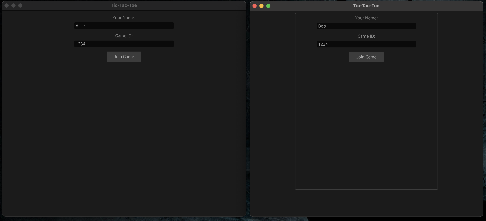
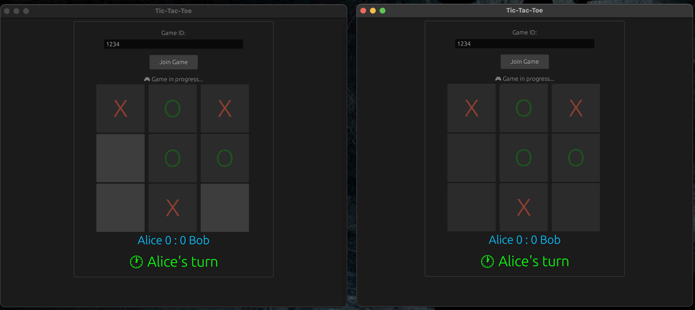
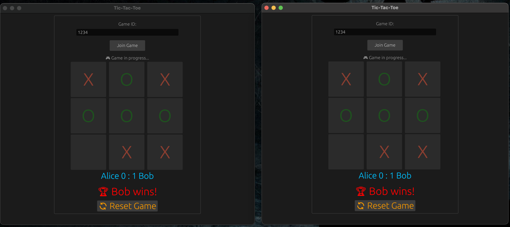

# 🧠 Tic-Tac-Toe Multiplayer (Rust)

A real-time multiplayer Tic-Tac-Toe game written entirely in Rust, using a native GUI (`egui`) and a WebSocket server (`axum`). Built to showcase  stateful game logic, async networking, real-time game logic, reconnection handling, and proper client-server architecture. 

---

## 1. ⚙️ Features 

- Real-time multiplayer over WebSockets
- Player name input and live scoreboard
- Clean turn-based logic with win/draw detection
- Game state is kept in sync across clients
- WebSocket to /ws, real-time JSON sync
- Uses **SplitSink** and **SplitStream** to cleanly separate read/write WebSocket channels
- Server state stored with **RwLock<HashMap<String, Game>>** for concurrent safety
- Built-in auto-reconnect if connection drops
- Periodic cleanup of inactive games
- Native UI 
- Clear and modular codebase — no unnecessary abstractions, every line does work

---

## 2. 🛠️ Tech Stack (Rust Crates)

### Client (GUI with WebSocket)
- `eframe` + `egui` → for UI rendering
- `tokio` + `tokio-tungstenite` → async networking
- `serde` / `serde_json` → message serialization
- `futures` → split stream and sink
- `tracing` → structured logging

### Server (WebSocket logic and state)
- `axum` → route handling + WebSocket upgrade
- `tokio::sync::broadcast` → state broadcasting
- `RwLock` + `Arc` → share state across sockets
- `tungstenite` → low-level WS protocol
- `tower` / `tower-http` → layering and HTTP support
- `anyhow` → error propagation

---

## 3. ♟️ Gameplay Flow

1. Player enters a **name** and a **game ID**
2. First two players become `Player::X` and `Player::O`
3. Server manages:
   - Game state
   - Turn switching
   - Scoring
4. Game ends on win or draw
5. Players can reset and continue playing
6. If a player disconnects, they can reconnect and resume

Server sends updates via broadcast, so all clients stay in sync.

---

## 4. 🖼️ Screenshots

| Join Game 
----

 |

----
| Gameplay 

 |

----

| Win 

  |

*UI is minimal and focused — built with egui.*

---

## 5. 🧪 Getting Started

### 🖥️ Run the GUI client

```bash
cd tic_tac_toe_client
cargo run
```

You can change the WebSocket URL in `GameService` if you want to connect to production.

---

##  Deployed Server

The backend is deployed and running in production.  
**WebSocket URL**: [`wss://tic-tac-toe-multiplayer-zg0e.onrender.com/ws`](https://tic-tac-toe-multiplayer-zg0e.onrender.com)

You can connect directly from the client — no setup needed.
 
 ---

### 🌐 Run the WebSocket server

```bash
cd tic_tac_toe_server
cargo run
```

By default, server runs on `0.0.0.0:3000` and listens for WebSocket upgrades at `/ws`.

---

